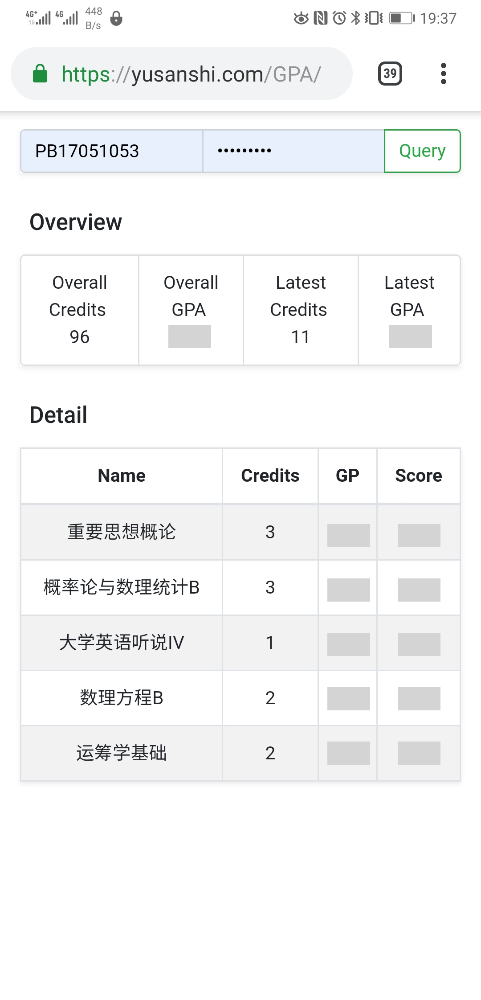

# USTC Grade Query

> 用于快速查询中科大学生成绩。

## 简介

用于快速查询中科大学生成绩，输入学号、密码后，能显示总体学分、总体 GPA 、本期学分、本期 GPA 以及本期的已出成绩。

分为前端和后端。前端使用 Bootstrap 框架，利用 Ajax 实现免刷新更新信息，前端接受用户输入的学号、密码，并负责显示成绩。后端使用 Python 脚本利用爬虫原理获取成绩，`get_grade.php`通过`POST`方式接收学号、密码，组合成相应的 python 命令，利用`shell_exec()`执行 python 命令，将输出以 json 编码返回。（没有采用 Flask 搭建接收`POST`请求的后端服务，因为我自己的前端网站是 https 加密的，它不允许从已加密的前端网站从未加密的后端接口获取信息，即不允许 http/https 混用。而在配置 Flask 的 https 加密的过程中我遇到了困难，遂放弃。）

演示站：https://yusanshi.com/GPA

> 为了安全，请勿轻易在别人搭建的第三方网页上输入自己的学号、密码（包括上面的我自己的站点），除非您信任该站长。建议浏览代码确认没问题后自行搭建网站。

## 运行

### Linux

1. 将`server`文件夹内的`login.py`和`get_grade.py`文件移动到某位置，赋予 PHP 用户对该位置的相应权限（如使用`ps -aux | grep php-fpm`查看 PHP 运行的用户，之后`chmod -R user dir`）；
2. 将`website`文件夹内的所有文件移动到网站目录；
3. 修改`website`里`get_grade.php`中的`$location`为`get_grade.py`文件的位置；
4. 在`get_grade.py`所在目录直接运行`python3 get_grade.py username password`（其中`username`和`password`分别为学号和密码），如提示有模块找不到安装相应模块，最后确认能输出本期成绩和学分、GPA（课程名称的中文经过 json 编码可能不能正常显示，但不影响）；
5. Enjoy it！

## 截图

